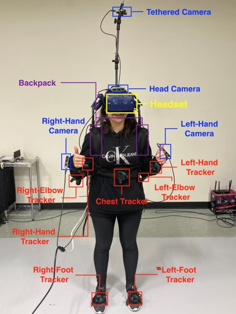
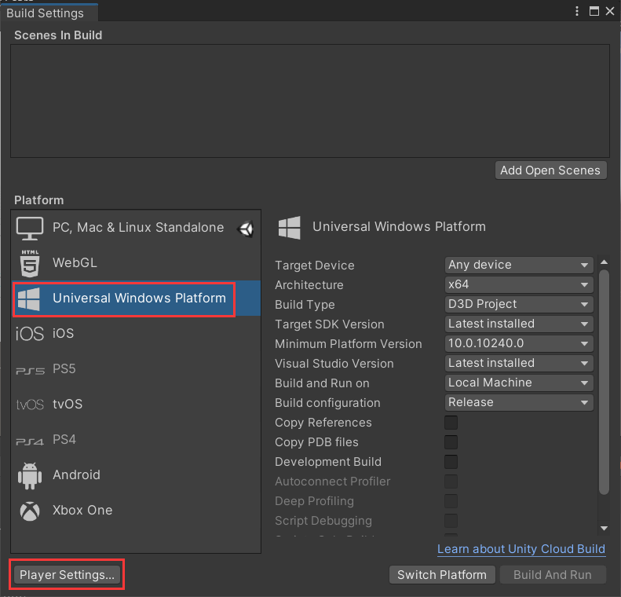

# Wearable-Multi-camera-System

This wearable camera system consists of HTC VIVE VR headset, trackers and Realsense RGB-D Cameras. It can be used for **human motion capture**, to **track human gaze input** (if you have VIVE Pro Eye), to **provide camera stream from various Realsense cameras**, or any combination of these modules.

  

## Setup

This repository is tested in Unity 2020+, but other Unity version should work as well.

#### **Start a new project**

In Unity hub, start a new empty 3D project. Name it "**VIVE-Motion-Capture-With-Wearable-Cameras**" (or other name you want).

#### **Install packages**

Depending on the module you use, you will need different packages:

- For any of these modules, the basic package you need is "[SteamVR Plugin](https://assetstore.unity.com/packages/tools/integration/steamvr-plugin-32647)". Please make sure you put it in your Unity asset, import and download it in this project. After downloaded, navigate to `Window -> SteamVR Input` and follow the instruction to generate necessary files.
- To use Realsense camera in Unity, 
- For eye tracking, 

#### **Download**

Git clone this repository. Merge the downloaded folder into your project folder, or put all the files and folders of this repository under your project folder. Open the corresponding scene you need in **Scenes** folder. Make sure your <u>SteamVR</u> is launched and all the components are paired before running any scenes.

# Demo Presentation

This module includes three parts, which are **Motion capture**, **Eye tracking** and **Multi-Camera Streaming and Switching**, respectively. 

## 1. Motion Capture

- Open scene **MotionCapture**.
- In the game object hierarchy, for each tracker, enter the serial number in the inspector. Serial number can be found in your SteamVR floating window by `≡ -> Devices -> Manage Vive Trackers -> ManageVive Trackers`.
- Launch SteamVR and make sure the headset and all the controllers are properly paired. Do a room setup in steamVR if the objects appear wrongly posed.
- Hit play in Unity, you should be able to see the trackers and the headset tracks properly.

  

## 2. Eye Tracking

Eye tracking is provided by HTC VIVE Pro headset which helps track the real-time gaze trajectory as well as facial expression of the experimenters when they wear the headset and look at the scene in it. All these are provided under the subitem "Eye Tracking" of the scene. And in fact it serves two main functions to help identify the gaze data: **1). one is to presense the real-time coordinates of the gaze on frame in pixel unit where the origin begins at bottom left corner point of the image in matrix shape,** and **2). another is to calculate the approximate time when use gazes at an object for quite a period.** Last but not least, **3). we set debuggering mode for this two functions which means that you can display or hide the effects by pressing the keyboard.**

### 1). Obtain Pixel Coordinates
In the world coordinate system, we attach Main Camera to the origin(0,0,0), and canvas is set to (0,0,100). Vector of gaze is provided by SDK of VIVE in C# script. We hereby design such an algorithm that we get the coordinate of the intersect point **P** between gaze ray and canvas, and then we can calculate the screen coordinates of **P** in pixel unit by comparing the relative position to the bottom left corner point and also the width & height of the image.  

  

### 2). Calculate Gaze Time 
For this function, we have set a range denoted by the input x and y to represent the region where we think the user is staring at an object in a concentrate way without his/her gaze moving out of the region. Once his/her gaze is at a valid position in the image, we begin to calculate the gaze time. And once his/her eyes move out of the region, we will recalculate it right then.

  

### 3). Debugger Mode
This additional function is provided to either display or hide other functions effect on the image, which we consider to be a way of debugging the gaze module. You can manipulate it by pressing **G** for hiding/showing gaze ray, **P** for hiding/showing pixel coordinates and **T** for hiding/showing gaze time duration. 

  

## 3. Multi-Camera Switch
In the RealSense Canvas item, the gameobject identifies each camera interface with the series number on it and all frames are collected by RealSense cameras into an all-in-one canvas. We implement camera switch by enabling the choosen camera object while blocking the rest in the meanwhile. In order to use the interface, you have to download [package](https://github.com/IntelRealSense/librealsense/releases/download/v2.50.0/Intel.RealSense.unitypackage) provided by RealSense and import it to the assets through **"Assets" --> "Import Package --> Custom Package..."**. Additionally, we designed two ways to switch frames displayed on canvas from these multiple cameras, one of which is to press button and another one is via speech.

### 1). Keyboard Switch
The method is implemented through pressing the key 'H','L','R','C','W' on keyboard to switch to 'Head','Left-Hand','Right-Hand','Clavicle' and 'World' Camera accordingly each at a time after running the whole program.

  

### 2). Speech Control Switch
We use speech SDK provided by Unity. The candidate speech words are: 'Head','Left','Right','Clavicle' and 'World', which cater to different cameras correspondingly. And there're two steps you may have to follow to so that you can implement it successfully:

#### i). Open up Unity Hub and make sure the module **Universal Winodws Platform Build Support** has been installed already;

#### ii). Open Unity Project, select **"File" --> "Build Settings" --> "Universal Windows Platform" --> "Player Settings" --> "Publishing Settings" --> "Capabilities" --> "Mircophone"** and tick it.

  

